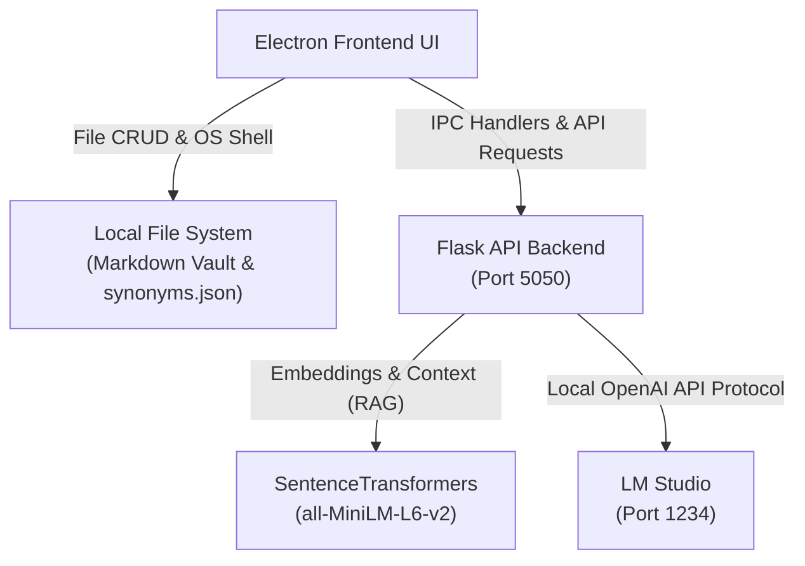

# 🧠 Mycelium

Mycelium App is a secure, fully local knowledge management system designed to run entirely on your own hardware. By combining intuitive note-taking with local AI capabilities—including semantic vector search, a custom synonym learning engine, and an offline Retrieval-Augmented Generation (RAG) assistant—your data stays private, permanent, and performant.

Inspired by the way fungal mycelium networks connect and exchange information beneath a forest floor, Mycelium helps isolated notes grow into an interconnected knowledge graph.

🌐 **The Bigger Picture:** Mycelium serves as the foundational data and intelligence layer for Mycelia, a larger upcoming personal ecosystem integrating local AI, IoT monitoring devices, automation, and intelligent edge platforms.

## 🚀 Core Features

### 📂 Native Vault Management
- **Direct File System Access:** Securely point the application to any local directory (`dialog:openVault`) to serve as your note sanctuary.
- **Full Markdown CRUD:** Create, read, update, and delete Markdown notes instantly via Node's native `fs` module.
- **Deep OS Integration:** Open note directories directly in Windows File Explorer or trigger external links natively and safely via Electron's `shell` module.

### 🧠 Semantic Vector Search (`/search`)
- **Context over Keywords:** Uses the `all-MiniLM-L6-v2` transformer model to compare the conceptual meaning of your search queries against your entire notes library rather than relying on brittle keyword matching.
- **Mathematical Relevance:** Computes a Cosine Similarity score across your notes to deliver a highly accurate, ranked list of relevant files.

### 🤖 Local RAG AI Assistant (`/ask-vault`)
- **Privacy-First Intelligence:** Connects to LM Studio via a local OpenAI-compatible client endpoint. Your personal notes never leave your computer.
- **Retrieval-Augmented Generation (RAG):** When you ask a question, the backend automatically performs a rapid semantic search, extracts the top 2 most contextually relevant notes, and injects them as factual ground-truth context directly into the AI's prompt instruction.

### 🔀 Custom Synonyms Engine
- **Keyword Mapping:** Features a dedicated dictionary manager built right into the dashboard interface to map technical terms, abbreviations, or shorthand keys to specific values.
- **Local Persistence:** Saves custom synonym pairs locally to `synonyms.json` using Electron IPC handles (`save-synonyms` / `load-synonyms`), keeping your search vocabulary persistent across sessions.

### 🔊 Bulletproof Native Text-to-Speech
- **Thread-Safe Speech Synthesis:** Integrates with the native Windows Speech API (`SAPI.SpVoice`).
- **Seamless Playback:** Utilizes background thread registration (`pythoncom`) to safely compile and vocalize AI responses aloud without freezing your UI or backend routine.

## 🏗️ Architecture & How It Works

The application splits its workload between a high-performance desktop shell and a localized machine learning backend:

- **Frontend Desktop Shell (Electron & Node.js):** Manages the native OS windows, handles secure Inter-Process Communication (IPC), and performs direct, synchronous CRUD operations on your local Markdown files (`.md`) and configuration files.
- **AI & Compute Backend (Python & Flask):** Runs a local micro-service that handles vector embeddings, parses your vault files for semantic similarities, interfaces with your local LLM, and interacts with the native Windows speech subsystem.



## 🛠️ Workspace Layout Breakdown

The workspace is split into an efficient, 3-column layout designed for rapid context switching:

- **Left Panel (Explorer):** Dynamically indexes all `.md` files in your configured vault. Includes global actions to open local folders natively or launch the Python AI background server via Command Prompt.
- **Center Panel (Workspace):** A clean Markdown workspace displaying note titles, text content previewing, and a dedicated action bar to read, update, or permanently delete files.
- **Right Panel (AI & Control):** Houses the semantic "Ask Vault" query stream, the live conversational AI response block, and the interactive Synonyms Editor for dictionary adjustments.

## ⚙️ Installation & Environment Setup

### Prerequisites
- Node.js (v16+ recommended)
- Python 3.8+
- LM Studio

> 💡 **Resource-Constrained Systems:** If you are running Mycelium on a laptop with limited RAM, it is highly recommended to load the lightweight `Qwen2.5-0.5B-Instruct-Q4_K_M.gguf` model inside LM Studio and ensure its local server is active on `http://localhost:1234`.

### 1. Backend Dependencies Setup

Open your terminal or command prompt and install the required machine learning and Windows integration packages:

```bash
pip install flask flask-cors sentence-transformers openai pywin32
```

⚠️ **Configuration Note:** Open `server_v4.py` before launching and verify that `MODEL_PATH` points to your local model directory and `VAULT_FOLDER` points to your active notes path.

### 2. Frontend Dependencies & Build

Navigate to your project root folder to install the required Node modules and compile your production assets:

```bash
# Install node modules
npm install

# Compile frontend source assets into the distribution folder
npm run build
```

## 🏃‍♂️ Running the Application

Follow these steps to spin up your local instance:

**Start the Backend Engine:** Launch your Python Flask server to initialize your embeddings and SAPI layers:

```bash
python server_v4.py
```

**Launch the Desktop UI:** In a separate terminal window, initiate the Electron application shell:

```bash
npm start
```

## 🔄 Local API Reference (Flask Backend)

### 1. Semantic Search

**Endpoint:** `POST /search`

**Payload:**
```json
{ "query": "your search term" }
```

**Returns:** A ranked array of local filenames paired with their corresponding mathematical cosine similarity coefficients.

### 2. Ask Vault (AI Chat + TTS)

**Endpoint:** `POST /ask-vault`

**Payload:**
```json
{ "query": "your question here" }
```

**Returns:**
```json
{ "answer": "AI generated string response" }
```

**Note:** Triggering this endpoint automatically executes local audio narration via native system hardware audio channels.


## 📄 License

Mycelium is licensed under the GNU Affero General Public License v3.0 (AGPL-3.0).

This means you are free to:

- Use the software
- Study the source code
- Modify the software
- Share the software

If you distribute modified versions or provide Mycelium as a network service,
you must also make the complete corresponding source code available under the
same AGPL-3.0 license.

See the LICENSE file for details.

## 💬 Author

Made with curiosity and perseverance by Junrey Paracuelles 🌱
