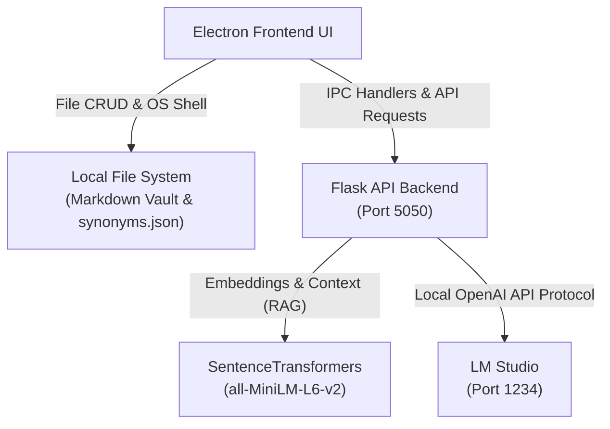

# 🧠 Mycelium

**Mycelium App** is an offline-first desktop knowledge graph and Markdown editor built with Electron, React, Python, and Machine Learning. It is designed as a secure, fully local knowledge management system that combines note-taking with AI-powered capabilities, including semantic search, a custom synonym learning engine, intelligent note discovery, and an offline Retrieval-Augmented Generation (RAG) AI assistant—all running entirely on your own computer.

Inspired by the way fungal mycelium networks connect and exchange information beneath a forest, Mycelium App helps ideas grow into an interconnected knowledge graph rather than remaining isolated notes.

Mycelium App serves as the foundation of **Mycelia**, a larger personal ecosystem that integrates AI, IoT devices, computer vision, automation, and future intelligent systems into a unified local platform.

---

## 🚀 Core Features

### 📂 Native Vault Management
* **Direct File System Access:** Securely point the application to any local directory (`dialog:openVault`) to serve as your note sanctuary.
* **Full Markdown CRUD:** Create, read, update, and delete Markdown notes instantly via Node's native `fs` module.
* **Deep OS Integration:** Open your note directories directly in Windows File Explorer or trigger external links natively in your default web browser safely via Electron's `shell` module.

### 🧠 Semantic Vector Search (`/search`)
* **Context over Keywords:** Uses the `all-MiniLM-L6-v2` transformer model to compare the conceptual *meaning* of your search queries against your entire notes library rather than relying on brittle keyword matching.
* **Mathematical Relevance:** Computes a Cosine Similarity score across your notes to deliver a highly accurate, ranked list of relevant files.

### 🤖 Local RAG AI Assistant (`/ask-vault`)
* **Privacy-First Intelligence:** Connects to **LM Studio** via a local OpenAI-compatible client endpoint. Your personal notes never leave your computer.
* **Retrieval-Augmented Generation (RAG):** When you ask a question, the backend automatically performs a rapid semantic search, extracts the top 2 most contextually relevant notes, and injects them as factual ground-truth context directly into the AI's prompt instruction.

### 🔀 Custom Synonyms Engine
* **Keyword Mapping:** Features a dedicated dictionary manager built right into the dashboard interface to map technical terms, abbreviations, or shorthand keys to specific values.
* **Local Persistence:** Saves custom synonym pairs locally to `synonyms.json` using Electron IPC handles (`save-synonyms` / `load-synonyms`), keeping your search vocabulary persistent across sessions.

### 🔊 Bulletproof Native Text-to-Speech
* **Thread-Safe Speech Synthesis:** Integrates with the native Windows Speech API (`SAPI.SpVoice`). 
* **Seamless Playback:** Utilizes background thread registration (`pythoncom`) to safely compile and vocalize AI responses aloud without freezing your UI or backend routine.

---

## 🏗️ Architecture & How It Works

The application splits its workload between a high-performance desktop shell and a localized machine learning backend:

1. **Frontend Desktop Shell (Electron & Node.js):** Manages the native OS windows, handles secure Inter-Process Communication (IPC), and performs direct, synchronous CRUD operations on your local Markdown files (`.md`) and configuration files.
2. **AI & Compute Backend (Python & Flask):** Runs a local micro-service that handles vector embeddings, parses your vault files for semantic similarities, interfaces with your local LLM, and interacts with the native Windows speech subsystem.

---

## 🚀 Getting Started

---

## 🛠️ Interface Breakdown

The workspace is split into a highly efficient, 3-column layout:
* **Left Panel (Explorer):** Dynamically indexes all `.md` files in your configured vault. Includes global actions to open local folders natively or launch the Python AI background server via Command Prompt.
* **Center Panel (Workspace):** A clean Markdown workspace displaying note titles, text content previewing, and a dedicated action bar to read, update, or permanently delete files.
* **Right Panel (AI & Control):** Houses the semantic "Ask Vault" query stream, the live conversational AI response block, and the interactive **Synonyms Editor** for dictionary adjustments.

---

## ⚙️ Installation & Environment Setup

### Prerequisites
* **Node.js** (v16+ recommended)
* **Python 3.8+**
* **LM Studio** (configured to run its local server on port `1234` with an active LLM loaded)

### 1. Backend Dependencies Installation
Open your terminal/command prompt and install the required machine learning and Windows integration packages:

pip install flask flask-cors sentence-transformers openai pywin32

⚠️ Configuration Note: Open server_v4.py and ensure MODEL_PATH points to your local model directory and VAULT_FOLDER points to your active notes path.

### 2. Frontend Dependencies & Build
Navigate to your project root folder and install your node modules:

# Install dependencies
npm install

# Compile your frontend source assets into the distribution folder
npm run build

## 🏃‍♂️ Running the Application

## Make sure LM Studio's local server is running on http://localhost:1234.
## load Qwen2.5-0.5b-instruct Q4_K_M.gguf model ( i use this model for limited RAM laptop )

## Launch the Python Flask server:
python server_v4.py

## Start the Electron desktop client:
npm start

## 🔄 Local API Reference (Flask Backend)
1. Semantic Search
Endpoint: POST /search

Payload: {"query": "your search term"}

Returns: A ranked list of filenames matched with their similarity coefficients.

2. Ask Vault (AI Chat + TTS)
Endpoint: POST /ask-vault

Payload: {"query": "your question here"}

Returns: {"answer": "AI generated string response"} (Also triggers local audio narration via system hardware).

---

📄 License
MIT License

💬 Author
Made with curiosity and perseverance by Junrey Paracuelles 🌱
